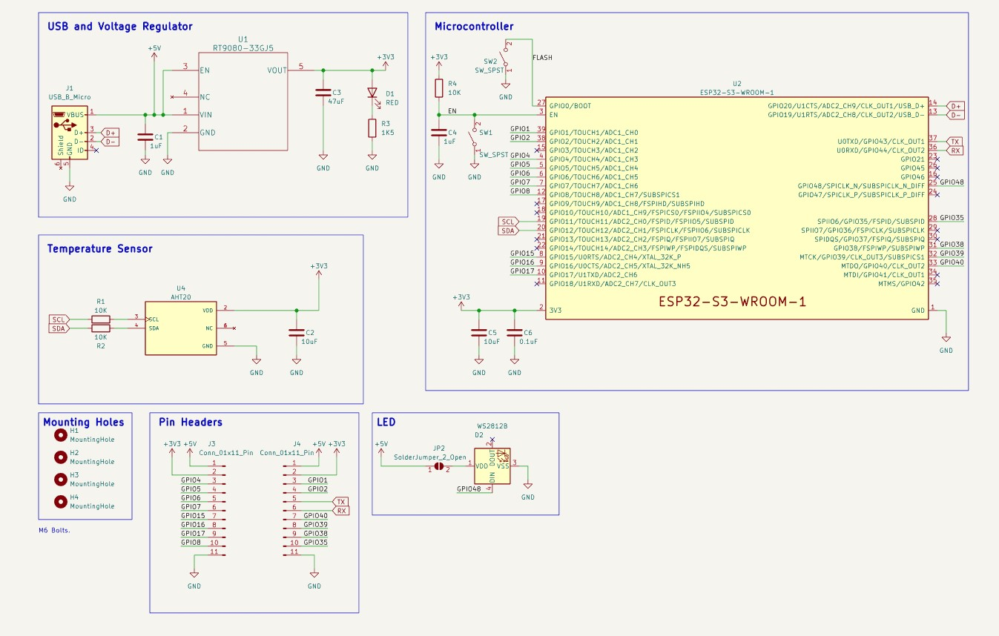
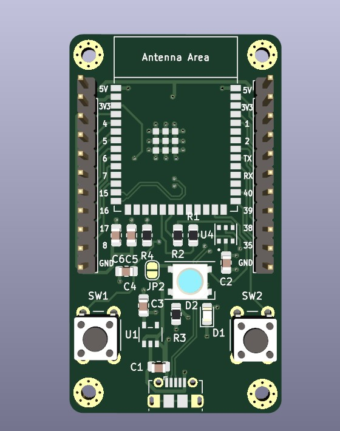
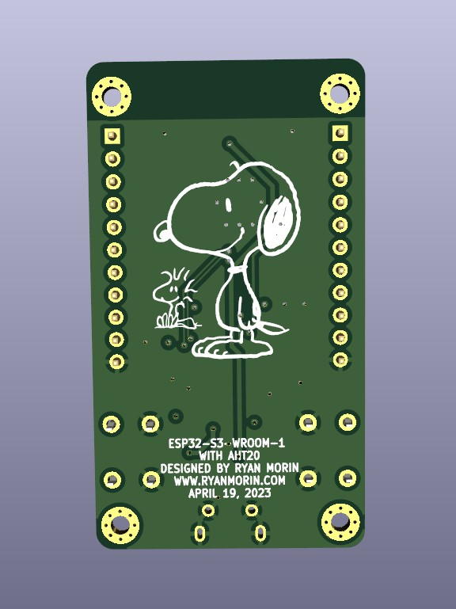

# Weather-Station ESP32-S3 with AHT-20

This is an ESP32-S3 development board created as a learning exercise in KiCad. It is designed to be a simple, low-cost board with a few basic features. The board contains a low quiescent current voltage regulator, a reset button, a boot button, and an RGB LED. The PCB contains a AHT20 temperature and humidity sensor.

## Features

- [ESP32-S3](https://www.espressif.com/en/products/socs/esp32-s3) - Dual-core 240Mhz processor with WiFi and Bluetooth
- Onboard WS2812B RGB LED connected to GPIO48
- Onboard Reset and Boot (GPIO0) switches

## Notes

To be added

## Libraries

To be added

## BOM

### Default

| Designator        | Part                  | Notes               |
| ----------        | --------------------- | ------------------- |
| C1, C4            | 	0805 SMD 1uF
| C2, C5            |   0805 SMD 10uF
| C3                |   0805 SMD 47uF
| C6                |   0805 SMD 0.1uF
| D1                |   0805 SMD LED
| D2                |   WS2812B
| H1, H2, H3, H4    |   Mounting Holes
| J1                |   Molex-105017-0001   | Micro-USB connector
| J3, J4            |   Headers             | 2.54mm Pin Header 1x11
| JP2               |   Solder Jumper       | For WS2812B LED
| R1, R2, R4        |   0805 SMD 10k Ohm
| R3                |   0805 SMD 1k5 Ohm
| SW1, SW2          |   Tactile switch 6mm
| U1                |   RT9080-33GJ5        | Voltage regulator
| U2                |   ESP32-S3-WROOM-1U   | Microcontroller
| U4                |   AHT20               | Temperature and humidity sensor

## Schematic

### Default

## Renders

